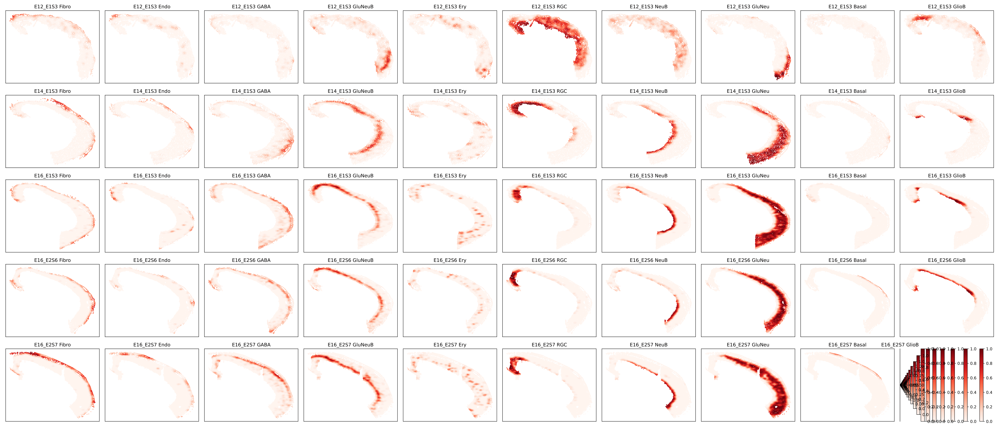
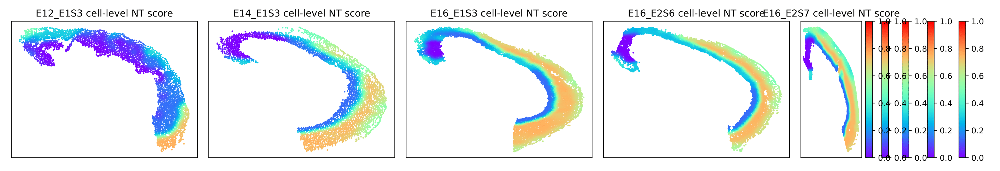
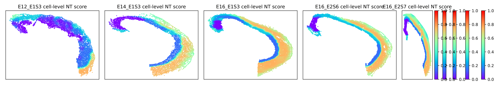
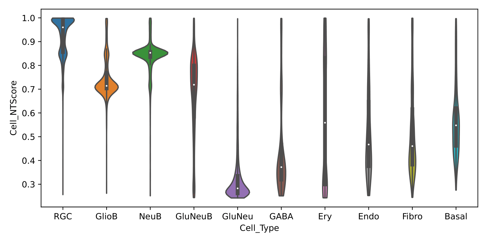

# **Ordered Niche Trajectory Construction** (ONTraC)

ONTraC (Ordered Niche Trajectory Construction) is a niche-centered, machine learning 
method for constructing spatially continuous trajectories. ONTraC differs from existing tools in 
that it treats a niche, rather than an individual cell, as the basic unit for spatial trajectory 
analysis. In this context, we define niche as a multicellular, spatially localized region where 
different cell types may coexist and interact with each other.  ONTraC seamlessly integrates 
cell-type composition and spatial information by using the graph neural network modeling 
framework. Its output, which is called the niche trajectory, can be viewed as a one dimensional
representation of the tissue microenvironment continuum. By disentangling cell-level and niche-
level properties, niche trajectory analysis provides a coherent framework to study coordinated 
responses from all the cells in association with continuous tissue microenvironment variations.

## Software dependencies

pandas=2.1.1

scipy=1.11.2

scikit-learn=1.3.0

pytorch=2.0.1

torchvision=0.15.2

torchaudio=2.0.2

pytorch-cuda=11.8

pyg_lib=0.2.0

torch_scatter=2.1.1

torch_sparse=0.6.17

torch_cluster=1.6.1

torch_spline_conv=1.2.2

torch_geometric=2.3.1

## Installation

- Setup environment following the instruction on `Environment_setup`
- Install `ONTraC`

  ```{sh}
  git clone https://github.com/wwang-chcn/ONTraC.git
  cd ONTraC && pip install .
  ```

## Tutorial

### Input File

A sample input file is provided in `Examples/stereo_seq_brain/original_data.csv`.
This file contains all input formation with five columns: Cell_ID, Sample, Cell_Type, x, and y.

| Cell_ID         | Sample   | Cell_Type | x       | y     |
| --------------- | -------- | --------- | ------- | ----- |
| E12_E1S3_100034 | E12_E1S3 | Fibro     | 15940   | 18584 |
| E12_E1S3_100035 | E12_E1S3 | Fibro     | 15942   | 18623 |
| ...             | ...      | ...       | ...     | ...   |
| E16_E2S7_326412 | E16_E2S7 | Fibro     | 32990.5 | 14475 |

### Running ONTraC

The required options for running ONTraC are the paths to the input file and the three output directories:

- **preprocessing-dir:** This directory stores preprocessed data and other intermediary datasets for analysis.
- **GNN-dir:** This directory stores output from running the GP (Graph Pooling) algorithm.
- **NTScore-dir:** This directory stores NTScore output.

```{sh}
cd Examples/stereo_seq_brain
ONTraC -d original_data.csv --preprocessing-dir stereo_seq_preprocessing_dir --GNN-dir stereo_seq_GNN --NTScore-dir stereo_seq_NTScore
```

All available parameter options are listed below. 

```{sh}
Options:
  --version             show program's version number and exit
  -h, --help            show this help message and exit

  IO:
    -d DATASET, --dataset=DATASET
                        Original input dataset.
    --preprocessing-dir=PREPROCESSING_DIR
                        Directory for preprocessing outputs.
    --GNN-dir=GNN_DIR   Directory for the GNN output.
    --NTScore-dir=NTSCORE_DIR
                        Directory for the NTScore output

  Niche Network Construction:
    --n-cpu=N_CPU       Number of CPUs used for parallel computing. Default is
                        4.
    --n-neighbors=N_NEIGHBORS
                        Number of neighbors used for kNN graph construction.
                        Default is 50.

  Options for training:
    --device=DEVICE     Device for training. Auto select if not specified.
    --epochs=EPOCHS     Number of maximum epochs for training. Default is 100.
    --patience=PATIENCE
                        Number of epochs wait for better result. Default is
                        50.
    --min-delta=MIN_DELTA
                        Minimum delta for better result. Default is 0.001
    --min-epochs=MIN_EPOCHS
                        Minimum number of epochs for training. Default is 100.
                        Set to 0 to disable.
    --batch-size=BATCH_SIZE
                        Batch size for training. Default is 0 for whole
                        dataset.
    -s SEED, --seed=SEED
                        Random seed for training. Default is random.
    --lr=LR             Learning rate for training. Default is 1e-3.
    --hidden-feats=HIDDEN_FEATS
                        Number of hidden features. Default is 32.
    -k K, --k-cluster=K
                        Number of spatial clusters. Default is 8.
    --spectral-loss-weight=SPECTRAL_LOSS_WEIGHT
                        Weight for spectral loss. Default is 1.
    --cluster-loss-weight=CLUSTER_LOSS_WEIGHT
                        Weight for cluster loss. Default is 1.
    --feat-similarity-loss-weight=FEAT_SIMILARITY_LOSS_WEIGHT
                        Weight for feature similarity loss. Default is 0.
    --assign-exponent=ASSIGN_EXPONENT
                        Exponent for assignment. Default is 1.
```

### Post-analysis

Below is an example of the kinds of post-analysis that could be performed. 

- Loading results

```python
from optparse import Values
from typing import List, Tuple

import numpy as np
import pandas as pd

from ONTraC.utils import read_yaml_file, get_rel_params


def load_data(options: Values) -> pd.DataFrame:
    """
    load data after ONTraC processing
    :param options, Values. dataset, preprocessing_dir and NTScore_dif needed.
    :return data_df, pd.DataFrame
    """
    data_df = pd.DataFrame()
    params = read_yaml_file(f'{options.preprocessing_dir}/samples.yaml')
    rel_params = get_rel_params(options, params)
    cell_type_code_df = pd.read_csv(f'{options.preprocessing_dir}/cell_type_code.csv', index_col=0)
    for sample in rel_params['Data']:
        NTScore_df = pd.read_csv(f'{options.NTScore_dif}/{sample["Name"]}_NTScore.csv.gz', index_col=0)
        cell_type_composition_df = pd.read_csv(sample['Features'], header=None)
        cell_type_composition_df.columns = cell_type_code_df.loc[np.arange(cell_type_composition_df.shape[1]), 'Cell_Type'].tolist()
        sample_df = pd.concat([NTScore_df.reset_index(drop=True), cell_type_composition_df], axis=1)
        sample_df.index = NTScore_df.index
        sample_df['sample'] = [sample["Name"]] * sample_df.shape[0]
        data_df = pd.concat([data_df, sample_df])
    
    raw_df = pd.read_csv(options.dataset, index_col=0)
    data_df = data_df.join(raw_df[['Cell_Type']])
    return data_df
```

```python
options = Values()
options.dataset = 'original_data.csv'
options.preprocessing_dir = 'stereo_seq_preprocessing_dir'
options.NTScore_dif = 'stereo_seq_NTScore'

data_df = load_data(options = options)
samples = data_df['sample'].unique().tolist()
cell_types = data_df['Cell_Type'].unique().tolist()
```

```{sh}
pip install matplotlib seaborn
```

```python
import matplotlib as mpl
import matplotlib.pyplot as plt
mpl.rcParams['pdf.fonttype'] = 42
mpl.rcParams['ps.fonttype'] = 42
mpl.rcParams['font.sans-serif'] = 'Arial'
import seaborn as sns
```

- Cell-type composition

```python
M, N = len(samples), len(cell_types)
fig, axes = plt.subplots(M, N, figsize = (3.5 * N, 3 * M))
for i, sample in enumerate(samples):
    sample_df = data_df.loc[data_df['sample'] == sample]
    for j, cell_type in enumerate(cell_types):
        ax = axes[i, j]
        scatter = ax.scatter(sample_df['x'], sample_df['y'], c=sample_df[cell_type], cmap='Reds', vmin=0, vmax=1, s=1)
        ax.set_xticks([])
        ax.set_yticks([])
        plt.colorbar(scatter)
        ax.set_title(f"{sample} {cell_type}")
    
fig.tight_layout()
fig.savefig('test_cell_type_compostion_bwr_color.pdf', transparent=True)
```



- Cell-level NT score spatial distribution

```python
N = len(samples)
fig, axes = plt.subplots(1, N, figsize = (3.5 * N, 3))
for i, sample in enumerate(samples):
    sample_df = data_df.loc[data_df['sample'] == sample]
    ax = axes[i]
    scatter = ax.scatter(sample_df['x'], sample_df['y'], c=1 - sample_df['Cell_NTScore'], cmap='rainbow', vmin=0, vmax=1, s=1) # substitute with following line if you don't need change the direction of NT score
    # scatter = ax.scatter(sample_df['x'], sample_df['y'], c=sample_df['Cell_NTScore'], cmap='rainbow', vmin=0, vmax=1, s=1)
    ax.set_xticks([])
    ax.set_yticks([])
    plt.colorbar(scatter)
    ax.set_title(f"{sample} cell-level NT score")
    
fig.tight_layout()
fig.savefig('test_cell_level_NT_score.pdf', transparent=True)
```



- Niche-level NT score spatial distribution

```python
N = len(samples)
fig, axes = plt.subplots(1, N, figsize = (3.5 * N, 3))
for i, sample in enumerate(samples):
    sample_df = data_df.loc[data_df['sample'] == sample]
    ax = axes[i]
    scatter = ax.scatter(sample_df['x'], sample_df['y'], c=1 - sample_df['Niche_NTScore'], cmap='rainbow', vmin=0, vmax=1, s=1) # substitute with following line if you don't need change the direction of NT score
    # scatter = ax.scatter(sample_df['x'], sample_df['y'], c=sample_df['Niche_NTScore'], cmap='rainbow', vmin=0, vmax=1, s=1)
    ax.set_xticks([])
    ax.set_yticks([])
    plt.colorbar(scatter)
    ax.set_title(f"{sample} cell-level NT score")
    
fig.tight_layout()
fig.savefig('test_niche_level_NT_score.pdf', transparent=True)
```



- Cell-level NT score distribution for each cell type

```python
fig, ax = plt.subplots(figsize = (8, 4))
sns.violinplot(data = data_df,
               x = 'Cell_Type',
               y = 'Cell_NTScore',
               order = ['RGC', 'GlioB', 'NeuB', 'GluNeuB', 'GluNeu', 'GABA', 'Ery', 'Endo', 'Fibro', 'Basal'],  # change based on your own dataset
               cut = 0,
               ax = ax)
fig.tight_layout()
fig.savefig('test_cell_level_NT_score_distribution_for_each_cell_type.pdf')
```



## Citation
