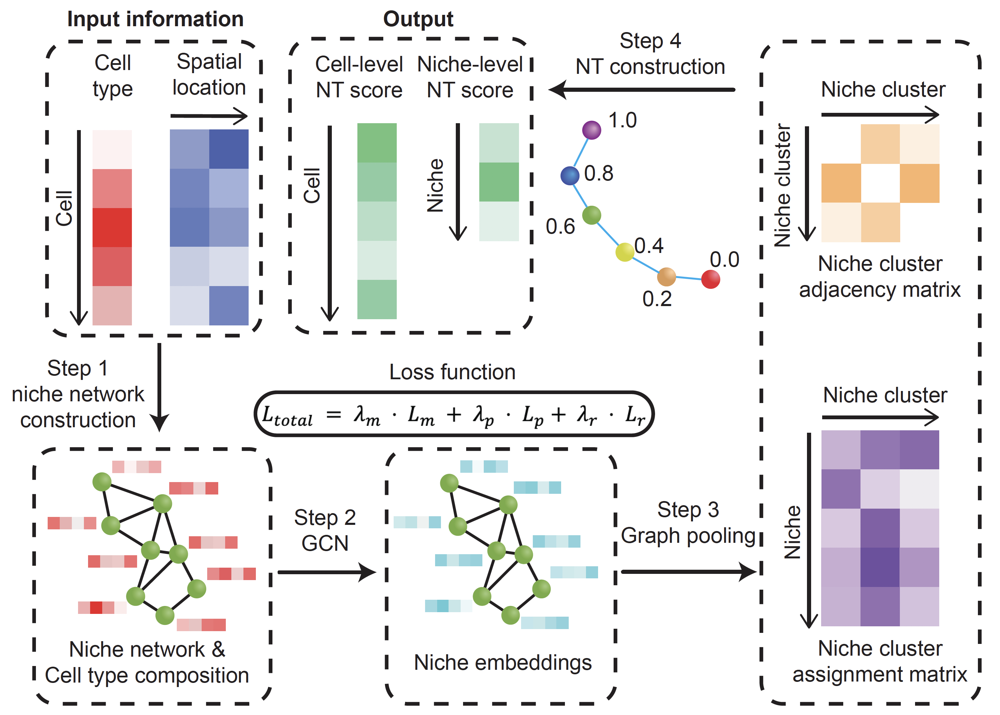

# **ONTraC**

[](https://pypi.org/project/ONTraC/)
[](https://pypi.org/project/ONTraC/)
[](https://pepy.tech/project/ONTraC)
[](https://pypistats.org/packages/ontrac)
[](https://github.com/gyuanlab/ONTraC)
[](https://github.com/gyuanlab/ONTraC/blob/master/LICENSE)

ONTraC (Ordered Niche Trajectory Construction) is a niche-centered, machine learning
method for constructing spatially continuous trajectories. ONTraC differs from existing tools in
that it treats a niche, rather than an individual cell, as the basic unit for spatial trajectory
analysis. In this context, we define niche as a multicellular, spatially localized region where
different cell types may coexist and interact with each other.  ONTraC seamlessly integrates
cell-type composition and spatial information by using the graph neural network modeling
framework. Its output, which is called the niche trajectory, can be viewed as a one dimensional
representation of the tissue microenvironment continuum. By disentangling cell-level and niche-
level properties, niche trajectory analysis provides a coherent framework to study coordinated
responses from all the cells in association with continuous tissue microenvironment variations.



## Required packages

pyyaml=6.0.1
pandas=2.1.1
pytorch=2.2.1
torch_geometric=2.5.1

## Installation

Please see the [installation tutorial](tutorials/installation.md)

## Tutorial

### Input File

A example input file is provided in `examples/stereo_seq_brain/original_data.csv`.
This file contains all input formation with five columns: Cell_ID, Sample, Cell_Type, x, and y.

| Cell_ID         | Sample   | Cell_Type | x       | y     |
| --------------- | -------- | --------- | ------- | ----- |
| E12_E1S3_100034 | E12_E1S3 | Fibro     | 15940   | 18584 |
| E12_E1S3_100035 | E12_E1S3 | Fibro     | 15942   | 18623 |
| ...             | ...      | ...       | ...     | ...   |
| E16_E2S7_326412 | E16_E2S7 | Fibro     | 32990.5 | 14475 |

For detailed information about input and output file, please see [IO files explanation](tutorials/IO_files.md#input-files).

### Running ONTraC

The required options for running ONTraC are the paths to the input file and the three output directories:

- **preprocessing-dir:** This directory stores preprocessed data and other intermediary datasets for analysis.
- **GNN-dir:** This directory stores output from running the GP (Graph Pooling) algorithm.
- **NTScore-dir:** This directory stores NTScore output.

```{sh}
cd examples/stereo_seq_brain
ONTraC -d original_data.csv --preprocessing-dir stereo_seq_preprocessing_dir --GNN-dir stereo_seq_GNN --NTScore-dir stereo_seq_NTScore
```

We recommand running `ONTraC` on GPU, it may take much more time on your own laptop with CPU only.

All available parameter options are listed below.

```{text}
Usage: ONTraC <-d DATASET> <--preprocessing-dir PREPROCESSING_DIR> <--GNN-dir GNN_DIR> <--NTScore-dir NTSCORE_DIR>
    [--n-cpu N_CPU] [--n-neighbors N_NEIGHBORS] [--device DEVICE] [--epochs EPOCHS] [--patience PATIENCE] [--min-delta MIN_DELTA] 
    [--min-epochs MIN_EPOCHS] [--batch-size BATCH_SIZE] [-s SEED] [--seed SEED] [--lr LR] [--hidden-feats HIDDEN_FEATS] [-k K_CLUSTERS]
    [--modularity-loss-weight MODULARITY_LOSS_WEIGHT] [--purity-loss-weight PURITY_LOSS_WEIGHT] 
    [--regularization-loss-weight REGULARIZATION_LOSS_WEIGHT] [--beta BETA]

All steps of ONTraC including dataset creation, Graph Pooling, and NT score
calculation.

Options:
  --version             show program's version number and exit
  -h, --help            show this help message and exit

  IO:
    -d DATASET, --dataset=DATASET
                        Original input dataset.
    --preprocessing-dir=PREPROCESSING_DIR
                        Directory for preprocessing outputs.
    --GNN-dir=GNN_DIR   Directory for the GNN output.
    --NTScore-dir=NTSCORE_DIR
                        Directory for the NTScore output

  Niche Network Construction:
    --n-cpu=N_CPU       Number of CPUs used for parallel computing. Default is
                        4.
    --n-neighbors=N_NEIGHBORS
                        Number of neighbors used for kNN graph construction.
                        Default is 50.

  Options for training:
    --device=DEVICE     Device for training. We support cpu and cuda now. Auto
                        select if not specified.
    --epochs=EPOCHS     Number of maximum epochs for training. Default is
                        1000.
    --patience=PATIENCE
                        Number of epochs wait for better result. Default is
                        100.
    --min-delta=MIN_DELTA
                        Minimum delta for better result. Default is 0.001
    --min-epochs=MIN_EPOCHS
                        Minimum number of epochs for training. Default is 50.
                        Set to 0 to disable.
    --batch-size=BATCH_SIZE
                        Batch size for training. Default is 0 for whole
                        dataset.
    -s SEED, --seed=SEED
                        Random seed for training. Default is random.
    --lr=LR             Learning rate for training. Default is 0.03.
    --hidden-feats=HIDDEN_FEATS
                        Number of hidden features. Default is 4.
    -k K, --k-clusters=K
                        Number of niche clusters. Default is 6.
    --modularity-loss-weight=MODULARITY_LOSS_WEIGHT
                        Weight for modularity loss. Default is 0.3.
    --purity-loss-weight=PURITY_LOSS_WEIGHT
                        Weight for purity loss. Default is 300.
    --regularization-loss-weight=REGULARIZATION_LOSS_WEIGHT
                        Weight for regularization loss. Default is 0.1.
    --beta=BETA         Beta value control niche cluster assignment matrix.
                        Default is 0.3.

```

### Output

The intermediate and final results are located in `preprocessing-dir`, `GNN-dir`, and `NTScore-dir` directories. Please see [IO files explanation](tutorials/IO_files.md#output-files) for detailed infromation.

### Visualization

Please see [post analysis tutorial](tutorials/post_analysis.md).

## Citation

**Wang, W.\*, Zheng, S.\*, Shin, C. S. & Yuan, G. C.$**. [Characterizing Spatially Continuous Variations in Tissue Microenvironment through Niche Trajectory Analysis](https://www.biorxiv.org/content/10.1101/2024.04.23.590827v1). *bioRxiv*, 2024.
