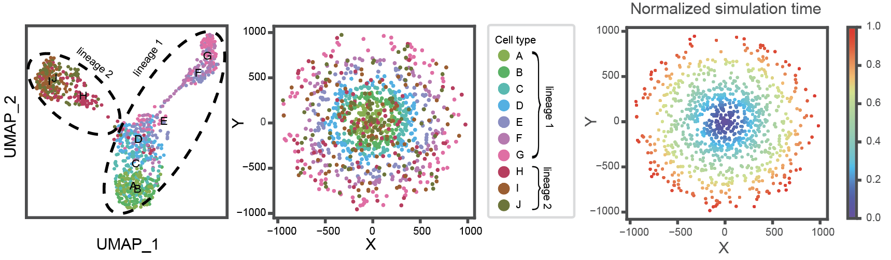

# Simulated Dataset

This dataset was generated using [dyngen](https://github.com/dynverse/dyngen) and consists 2 lineages, 10 cell types, and 1,000 cells. Lineage 1 cells exhibit a strong correlation between the spatial distribution (radius) and simulated time, while lineage 2 cells have a random spatial distribution.

## Files in this directory

- simulation_dataset_sce.rds
File contains the information generated by dyngen.
- meta_data.csv
Input file for `ONTraC`, spatial distribution information inside it.
- pseudotime_output.csv
File contains the output of `ONTraC` and other four methods.

## Comparison Results

ONTraC can provide a uniformed and proper description (cell-level NT score) for all cells, whereas other methods can only provide proper description (pseudotime) for cells in lineage 1.
