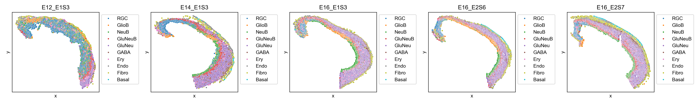
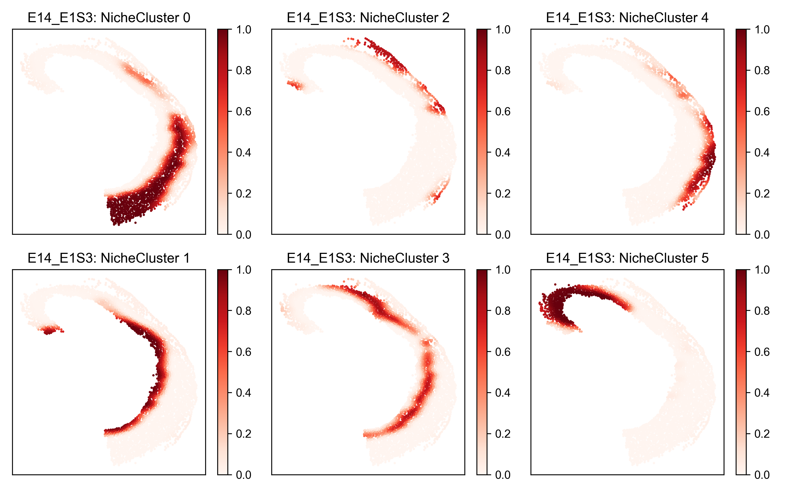
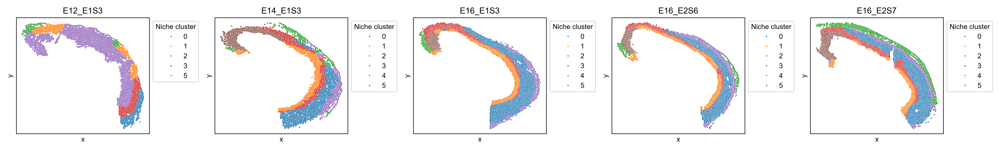

# Niche clusters

`ONTraC` (Ordered Niche Trajectory Construction) is a niche-centered, machine learning method for constructing spatially continuous trajectories. ONTraC differs from existing tools in that it treats a niche, rather than an individual cell, as the basic unit for spatial trajectory analysis. In this context, we define niche as a multicellular, spatially localized region where different cell types may coexist and interact with each other. ONTraC seamlessly integrates cell-type composition and spatial information by using the graph neural network modeling framework.

ONTraC generate `niche cluster` an assignment matrix as an intermediate result. It is possible for users to utilise the niche cluster information as spatial domains or other downstreaming analysis. The following section outlines the process for running `ONTraC` on stereo-seq data and visualising which niche cluster each cell belongs to.

## prepare

### Install required packages and ONTraC

Please see the [installation tutorial](installation.md)

### Running ONTraC

```{sh}
cd examples/stereo_seq_brain
ONTraC -d original_data.csv --preprocessing-dir stereo_seq_preprocessing_dir --GNN-dir stereo_seq_GNN --NTScore-dir stereo_seq_NTScore --epochs 100 --batch-size 5 -s 42 --patience 100 --min-delta 0.001 --min-epochs 50 --lr 0.03 --hidden-feats 4 -k 6 --modularity-loss-weight 0.3 --regularization-loss-weight 0.1 --purity-loss-weight 300 --beta 0.03 2>&1 | tee stereo_seq_final.log
```

In this instance, the epoch value was set to 100. This is a typical value that can be used to obtain results, and it can be set to 1,000 or more if one wishes to obtain a more convergence results.

### Loading results

```{python}
from optparse import Values

import numpy as np
import pandas as pd

from ONTraC.utils import read_yaml_file, get_rel_params


def load_data(options: Values) -> pd.DataFrame:
    """
    load data after ONTraC processing
    :param options, Values. dataset, preprocessing_dir and NTScore_dif needed.
    :return data_df, pd.DataFrame
    """
    data_df = pd.DataFrame()
    params = read_yaml_file(f'{options.preprocessing_dir}/samples.yaml')
    rel_params = get_rel_params(options, params)
    cell_type_code_df = pd.read_csv(f'{options.preprocessing_dir}/cell_type_code.csv', index_col=0)
    for sample in rel_params['Data']:
        NTScore_df = pd.read_csv(f'{options.NTScore_dif}/{sample["Name"]}_NTScore.csv.gz', index_col=0)
        cell_type_composition_df = pd.read_csv(sample['Features'], header=None)
        cell_type_composition_df.columns = cell_type_code_df.loc[np.arange(cell_type_composition_df.shape[1]), 'Cell_Type'].tolist()
        sample_df = pd.concat([NTScore_df.reset_index(drop=True), cell_type_composition_df], axis=1)
        sample_df.index = NTScore_df.index
        sample_df['sample'] = [sample["Name"]] * sample_df.shape[0]
        data_df = pd.concat([data_df, sample_df])
    
    raw_df = pd.read_csv(options.dataset, index_col=0)
    data_df = data_df.join(raw_df[['Cell_Type']])
    return data_df


```

```{python}
# create options object
options = Values()
options.dataset = 'original_data.csv'
options.preprocessing_dir = 'stereo_seq_preprocessing_dir'
options.GNN_dir = 'stereo_seq_GNN'
options.NTScore_dif = 'stereo_seq_NTScore'

# load results
data_df = load_data(options = options)
niche_cluster_assign_matrix = pd.read_csv(f'{options.GNN_dir}/cell_level_niche_cluster.csv.gz', index_col=0)
data_df = data_df.join(niche_cluster_assign_matrix)
niche_cluster_df = pd.read_csv(f'{options.GNN_dir}/cell_level_max_niche_cluster.csv.gz', index_col=0)
data_df = data_df.join(niche_cluster_df)

samples = data_df['sample'].unique().tolist()
```

### Plotting preprare

```{python}
import matplotlib as mpl
import matplotlib.pyplot as plt
mpl.rcParams['pdf.fonttype'] = 42
mpl.rcParams['ps.fonttype'] = 42
mpl.rcParams['font.sans-serif'] = 'Arial'
import seaborn as sns
```

## Spatial cell type distribution

```{python}
N = len(samples)
fig, axes = plt.subplots(1, N, figsize = (4 * N, 3))
for i, sample in enumerate(samples):
    sample_df = data_df.loc[data_df['sample'] == sample]
    ax = axes[i] if N > 1 else axes
    sns.scatterplot(data = sample_df,
                x = 'x',
                y = 'y',
                hue = 'Cell_Type',
                hue_order = ['RGC', 'GlioB', 'NeuB', 'GluNeuB', 'GluNeu', 'GABA', 'Ery', 'Endo', 'Fibro', 'Basal'],  # change based on your own dataset or remove this line
                s = 8,
                ax = ax)
    ax.set_xticks([])
    ax.set_yticks([])
    ax.set_title(f"{sample}")
    ax.legend(loc='upper left', bbox_to_anchor=(1,1))


fig.tight_layout()
fig.savefig('Spatial_cell_type.png', dpi=300)
```



## Spatial niche cluster probability

ONTraC assign each cell to each niche cluster with a probability which can be visualize as following:

```{python}
niche_clusters = sorted(data_df['Niche_Cluster'].unique())

N = len(niche_clusters)
for sample in samples:
    sample_df = data_df.loc[data_df['sample'] == sample]
    if 1 < N < 4:  # N can not be less than 2
        fig, axes = plt.subplots(1, N, figsize=(3.2 * N , 3))
    else:
        fig, axes = plt.subplots(2, (N + 1) // 2, figsize=(3.2 * ((N + 1) // 2) , 6))
    for n, niche_cluster in enumerate(niche_clusters):
        if 1 < N < 4:
            ax = axes[n]
        else:
            q, r = divmod(n, 2)
            ax = axes[r, q]
        scatter = ax.scatter(sample_df['x'], sample_df['y'], c=sample_df[f'NicheCluster_{niche_cluster}'], cmap='Reds', vmin=0, vmax=1, s=1)
        ax.set_xticks([])
        ax.set_yticks([])
        ax.set_title(f'{sample}: niche cluster {niche_cluster}')
        plt.colorbar(scatter)
    fig.tight_layout()
    fig.savefig(f'figures/spatial_cluster_prob_{sample}.png', dpi=300)


```



## Spatial niche cluster

A binarized version of niche cluster for each cell can visualize as following:

```{python}
N = len(samples)
fig, axes = plt.subplots(1, N, figsize = (4 * N, 3))
for i, sample in enumerate(samples):
    sample_df = data_df.loc[data_df['sample'] == sample]
    sample_df['Niche_Cluster'] = pd.Categorical(sample_df['Niche_Cluster'])
    ax = axes[i] if N > 1 else axes
    sns.scatterplot(data = sample_df,
                x = 'x',
                y = 'y',
                hue = 'Niche_Cluster',
                s = 4,
                ax = ax)
    ax.set_xticks([])
    ax.set_yticks([])
    ax.set_title(f"{sample}")
    ax.legend(title='Niche cluster', loc='upper left', bbox_to_anchor=(1,1))


fig.tight_layout()
fig.savefig('figures/Spatial_niche_cluster.png', dpi=300)
```


