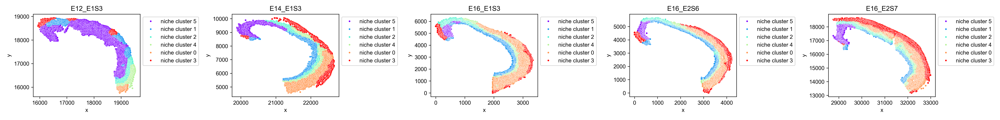
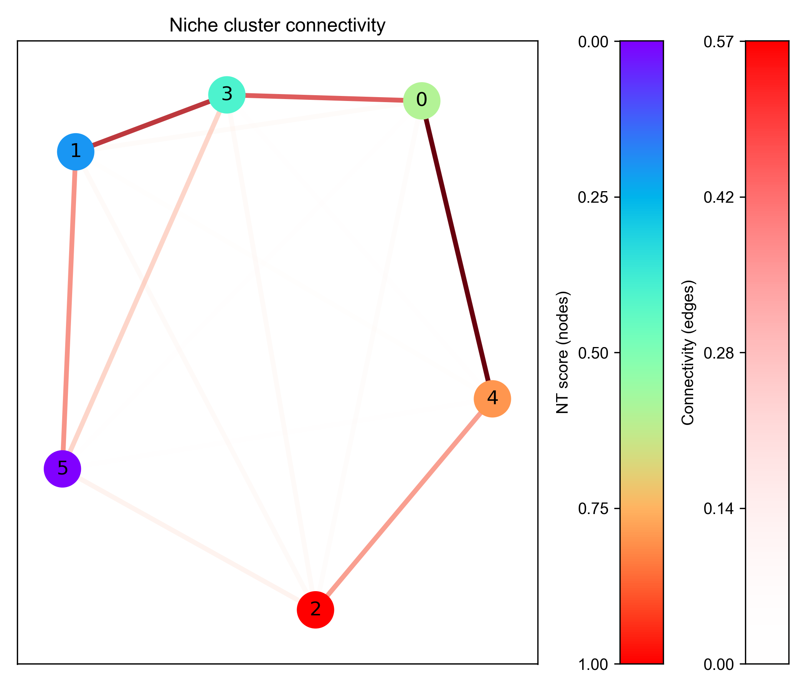
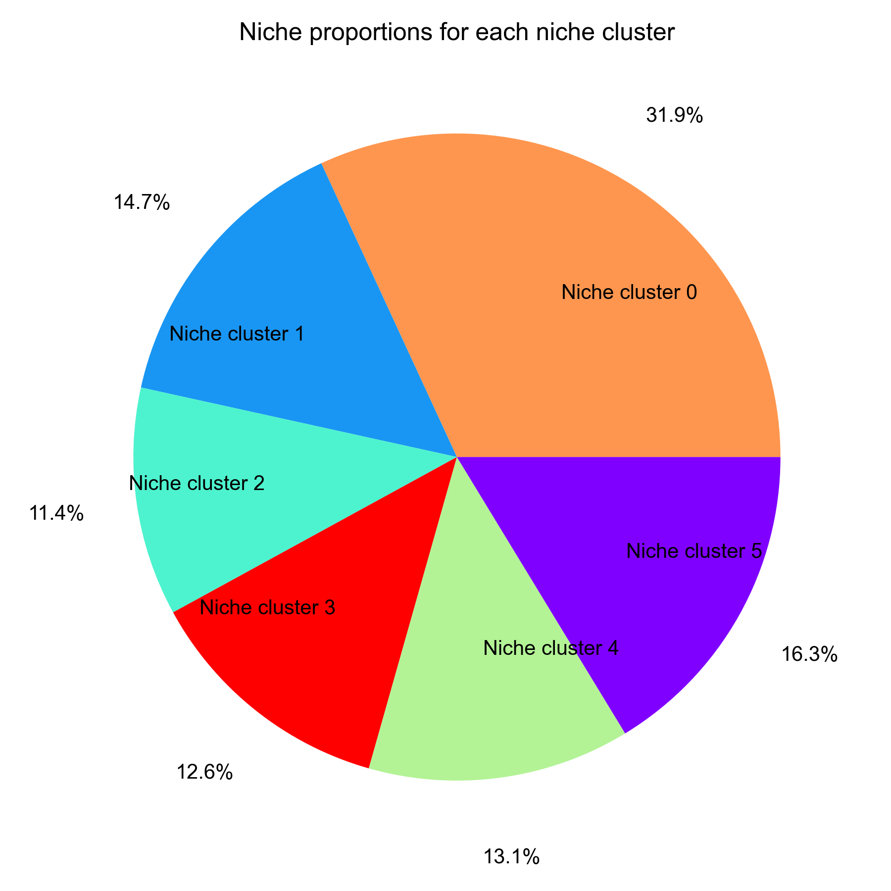
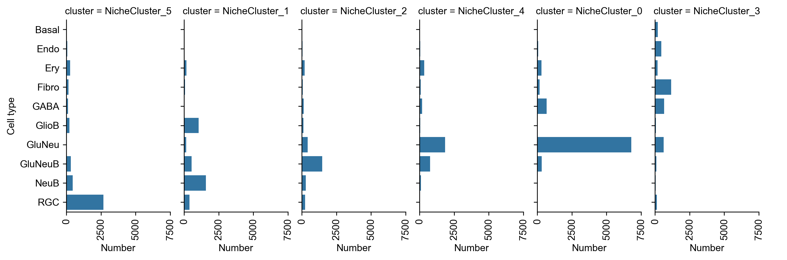
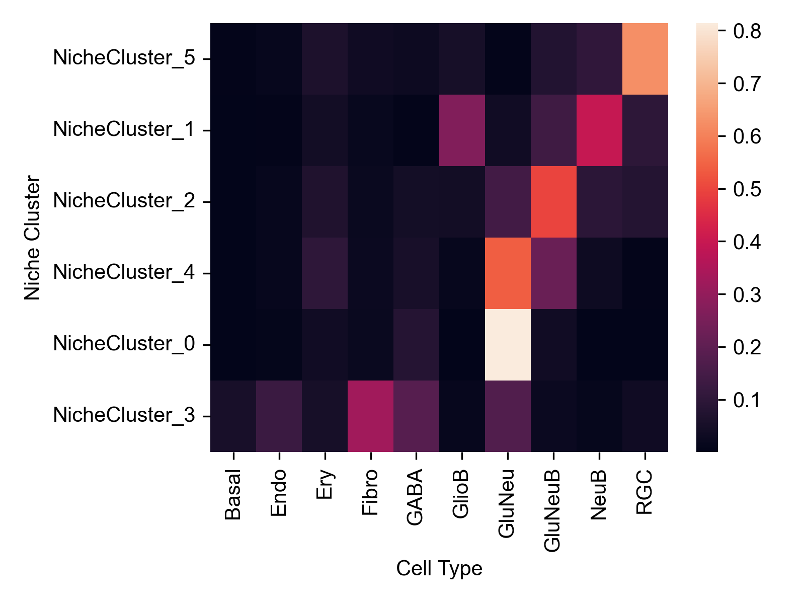
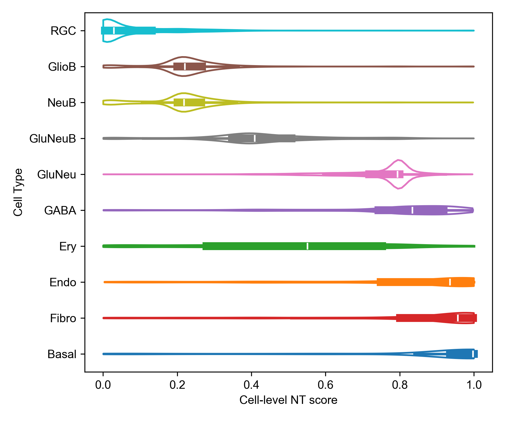

# Niche clusters

`ONTraC` (Ordered Niche Trajectory Construction) is a niche-centered, machine learning method for constructing spatially continuous trajectories. ONTraC differs from existing tools in that it treats a niche, rather than an individual cell, as the basic unit for spatial trajectory analysis. In this context, we define niche as a multicellular, spatially localized region where different cell types may coexist and interact with each other. ONTraC seamlessly integrates cell-type composition and spatial information by using the graph neural network modeling framework.

ONTraC generate `niche cluster` an assignment matrix as an intermediate result. It is possible for users to utilise the niche cluster information as spatial domains or other downstreaming analysis. The following section outlines the process for running `ONTraC` on stereo-seq data and visualising which niche cluster each cell belongs to.

## prepare

### Install required packages and ONTraC

Please see the [installation tutorial](installation.md)

### Running ONTraC

```{sh}
ONTraC --meta-input data/stereo_seq_brain/original_data.csv --NN-dir output/stereo_seq_NN --GNN-dir output/stereo_seq_GNN --NT-dir output/stereo_seq_NT --device cuda -s 42 --lr 0.03 --hidden-feats 4 -k 6 --modularity-loss-weight 0.3 --regularization-loss-weight 0.1 --purity-loss-weight 300 --beta 0.03 2>&1 | tee log/stereo_seq.log
```

The input dataset and output files could be downloaded from [Zenodo](https://zenodo.org/records/11186620).

## Visualization

### Install required packages

```{sh}
pip install ONTraC[analysis]
# or
pip install seaborn
```

### Load modules

```{python}
import numpy as np
import pandas as pd

import matplotlib as mpl

mpl.rcParams['pdf.fonttype'] = 42
mpl.rcParams['ps.fonttype'] = 42
mpl.rcParams['font.family'] = 'Arial'
import matplotlib.pyplot as plt
import seaborn as sns

from ONTraC.analysis.data import AnaData
```

### Plotting preprare

```{python}
from optparse import Values

options = Values()
options.NN_dir = 'stereo_seq_NN'
options.GNN_dir = 'stereo_seq_GNN'
options.NT_dir = 'stereo_seq_NT'
options.log = 'stereo_seq_final.log'
options.reverse = True  # Set it to False if you don't want reverse NT score
options.output = None  # We save the output figure by our self here
ana_data = AnaData(options)
```

### Spatial niche cluster loadings distribution

```{python}
from ONTraC.analysis.niche_cluster import plot_niche_cluster_loadings_dataset_from_anadata

fig, axes = plot_niche_cluster_loadings_dataset_from_anadata(ana_data=ana_data)
fig.savefig('figures/Spatial_niche_clustering_loadings.png', dpi=100)
```


### Spatial maximum niche cluster distribution

```{python}
from ONTraC.analysis.niche_cluster import plot_max_niche_cluster_dataset_from_anadata

fig, axes = plot_max_niche_cluster_dataset_from_anadata(ana_data=ana_data)
fig.savefig('figures/Spatial_max_niche_cluster.png', dpi=300)
```



### Niche cluster connectivity

```{python}
from ONTraC.analysis.niche_cluster import plot_niche_cluster_connectivity_from_anadata

fig, axes = plot_niche_cluster_connectivity_from_anadata(ana_data=ana_data)
fig.savefig('figures/Niche_cluster_connectivity.png', dpi=300)
```



### Niche cluster proportion

```{python}
from ONTraC.analysis.niche_cluster import plot_cluster_proportion_from_anadata

fig, ax = plot_cluster_proportion_from_anadata(ana_data=ana_data)
fig.savefig('figures/Niche_cluster_proportions.png', dpi=300)
```



### Cell type X niche cluster

#### Number of cells of each cell type cells in each niche cluster

```{python}
from ONTraC.analysis.cell_type import plot_cell_type_loading_in_niche_clusters_from_anadata

g = plot_cell_type_loading_in_niche_clusters_from_anadata(ana_data=ana_data)
g.savefig('figures/cell_type_loading_in_niche_clusters.png', dpi=300)
```



#### Cell type composition in each niche cluster

```{python}
from ONTraC.analysis.cell_type import plot_cell_type_com_in_niche_clusters_from_anadata

fig, ax = plot_cell_type_com_in_niche_clusters_from_anadata(ana_data=ana_data)
fig.savefig('figures/cell_type_composition_in_niche_clusters.png', dpi=300)
```


This heatmap show the cell type composition within each niche cluster. Sum of each row equals to 1.

#### Cell type distribution across niche clusters

```{python}
from ONTraC.analysis.cell_type import plot_cell_type_dis_across_niche_cluster_from_anadata

fig, ax = plot_cell_type_dis_across_niche_cluster_from_anadata(ana_data=ana_data)
fig.savefig('figures/cell_type_dis_across_niche_cluster.png', dpi=300)
```


This heatmap show the cell type distribution across niche clusters. Sum of each column equals to 1.

### Spatial niche-level NT score distribution

```{python}
from ONTraC.analysis.spatial import plot_niche_NT_score_dataset_from_anadata

fig, ax = plot_niche_NT_score_dataset_from_anadata(ana_data=ana_data)
fig.savefig('figures/niche_NT_score.png', dpi=200)
```


## Spatial cell-level NT score distribution

```{python}
from ONTraC.analysis.spatial import plot_cell_NT_score_dataset_from_anadata

fig, ax = plot_cell_NT_score_dataset_from_anadata(ana_data=ana_data)
fig.savefig('figures/cell_NT_score.png', dpi=200)
```


## Cell-level NT score distribution for each cell type

```{python}
from ONTraC.analysis.cell_type import plot_violin_cell_type_along_NT_score_from_anadata

fig, ax = plot_violin_cell_type_along_NT_score_from_anadata(ana_data=ana_data,
                                                            order=['RGC', 'GlioB', 'NeuB', 'GluNeuB', 'GluNeu', 'GABA', 'Ery', 'Endo', 'Fibro', 'Basal'],  # change based on your own dataset or remove this line
                                                           )
fig.savefig('figures/cell_type_along_NT_score_violin.png', dpi=300)
```


