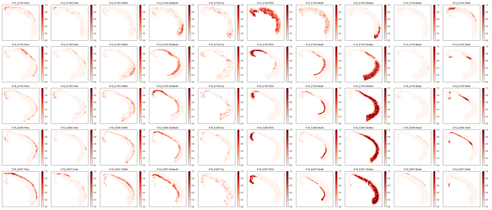
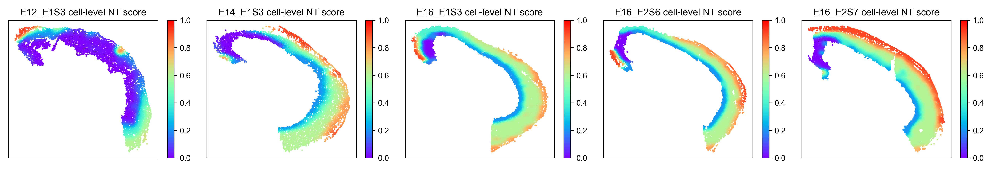
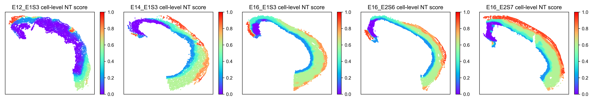
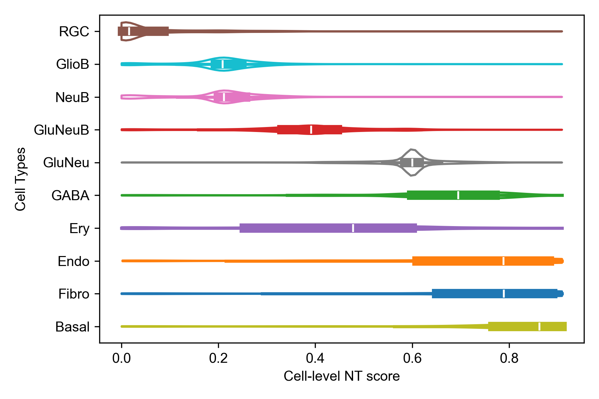

# Post-analysis

Below is an example of post-analysis on stereo-seq brain data.

## prepare

### Install required packages

```{sh}
pip install matplotlib seaborn
```

### Loading results

```{python}
from optparse import Values
from typing import List, Tuple

import numpy as np
import pandas as pd

from ONTraC.utils import read_yaml_file, get_rel_params


def load_data(options: Values) -> pd.DataFrame:
    """
    load data after ONTraC processing
    :param options, Values. dataset, preprocessing_dir and NTScore_dif needed.
    :return data_df, pd.DataFrame
    """
    data_df = pd.DataFrame()
    params = read_yaml_file(f'{options.preprocessing_dir}/samples.yaml')
    rel_params = get_rel_params(options, params)
    cell_type_code_df = pd.read_csv(f'{options.preprocessing_dir}/cell_type_code.csv', index_col=0)
    for sample in rel_params['Data']:
        NTScore_df = pd.read_csv(f'{options.NTScore_dif}/{sample["Name"]}_NTScore.csv.gz', index_col=0)
        cell_type_composition_df = pd.read_csv(sample['Features'], header=None)
        cell_type_composition_df.columns = cell_type_code_df.loc[np.arange(cell_type_composition_df.shape[1]), 'Cell_Type'].tolist()
        sample_df = pd.concat([NTScore_df.reset_index(drop=True), cell_type_composition_df], axis=1)
        sample_df.index = NTScore_df.index
        sample_df['sample'] = [sample["Name"]] * sample_df.shape[0]
        data_df = pd.concat([data_df, sample_df])
    
    raw_df = pd.read_csv(options.dataset, index_col=0)
    data_df = data_df.join(raw_df[['Cell_Type']])
    return data_df


```

```{python}
options = Values()
options.dataset = 'original_data.csv'
options.preprocessing_dir = 'stereo_seq_final_preprocessing_dir'
options.NTScore_dif = 'stereo_seq_final_NTScore'

data_df = load_data(options = options)
samples = data_df['sample'].unique().tolist()
cell_types = data_df['Cell_Type'].unique().tolist()
```

### Plotting preprare

```{python}
import matplotlib as mpl
import matplotlib.pyplot as plt
mpl.rcParams['pdf.fonttype'] = 42
mpl.rcParams['ps.fonttype'] = 42
mpl.rcParams['font.sans-serif'] = 'Arial'
import seaborn as sns
```

## Spatial cell type distribution

```{python}
N = len(samples)
fig, axes = plt.subplots(1, N, figsize = (4 * N, 3))
for i, sample in enumerate(samples):
    sample_df = data_df.loc[data_df['sample'] == sample]
    ax = axes[i] if N > 1 else axes
    sns.scatterplot(data = sample_df,
                x = 'x',
                y = 'y',
                hue = 'Cell_Type',
                hue_order = ['RGC', 'GlioB', 'NeuB', 'GluNeuB', 'GluNeu', 'GABA', 'Ery', 'Endo', 'Fibro', 'Basal'],  # change based on your own dataset or remove this line
                s = 8,
                ax = ax)
    ax.set_xticks([])
    ax.set_yticks([])
    ax.set_title(f"{sample}")
    ax.legend(loc='upper left', bbox_to_anchor=(1,1))


fig.tight_layout()
fig.savefig('Spatial_cell_type.png', dpi=300)
```


## Cell-type composition

```{python}
M, N = len(samples), len(cell_types)
fig, axes = plt.subplots(M, N, figsize = (3.5 * N, 3 * M))
for i, sample in enumerate(samples):
    sample_df = data_df.loc[data_df['sample'] == sample]
    for j, cell_type in enumerate(cell_types):
        ax = axes[i, j] if M > 1 else axes[j]
        scatter = ax.scatter(sample_df['x'], sample_df['y'], c=sample_df[cell_type], cmap='Reds', vmin=0, vmax=1, s=1)
        ax.set_xticks([])
        ax.set_yticks([])
        plt.colorbar(scatter)
        ax.set_title(f"{sample} {cell_type}")


fig.tight_layout()
fig.savefig('cell_type_compostion.png', dpi=100)
```



## Cell-level NT score spatial distribution

```{python}
N = len(samples)
fig, axes = plt.subplots(1, N, figsize = (3.5 * N, 3))
for i, sample in enumerate(samples):
    sample_df = data_df.loc[data_df['sample'] == sample]
    ax = axes[i] if N > 1 else axes
    scatter = ax.scatter(sample_df['x'], sample_df['y'], c=1 - sample_df['Cell_NTScore'], cmap='rainbow', vmin=0, vmax=1, s=1) # substitute with following line if you don't need change the direction of NT score
    # scatter = ax.scatter(sample_df['x'], sample_df['y'], c=sample_df['Cell_NTScore'], cmap='rainbow', vmin=0, vmax=1, s=1)
    ax.set_xticks([])
    ax.set_yticks([])
    plt.colorbar(scatter)
    ax.set_title(f"{sample} cell-level NT score")


fig.tight_layout()
fig.savefig('cell_level_NT_score.png', dpi=300)
```



## Niche-level NT score spatial distribution

```{python}
N = len(samples)
fig, axes = plt.subplots(1, N, figsize = (3.5 * N, 3))
for i, sample in enumerate(samples):
    sample_df = data_df.loc[data_df['sample'] == sample]
    ax = axes[i] if N > 1 else axes
    scatter = ax.scatter(sample_df['x'], sample_df['y'], c= 1 - sample_df['Niche_NTScore'], cmap='rainbow', vmin=0, vmax=1, s=1) # substitute with following line if you don't need change the direction of NT score
    # scatter = ax.scatter(sample_df['x'], sample_df['y'], c=sample_df['Niche_NTScore'], cmap='rainbow', vmin=0, vmax=1, s=1)
    ax.set_xticks([])
    ax.set_yticks([])
    plt.colorbar(scatter)
    ax.set_title(f"{sample} cell-level NT score")


fig.tight_layout()
fig.savefig('niche_level_NT_score.png', dpi=300)
```



## Cell-level NT score distribution for each cell type

```{python}
data_df['Cell_NTScore_r'] = 1 - data_df['Cell_NTScore'] # remove if you don't need change the direction of NT score

fig, ax = plt.subplots(figsize = (6, 4))
sns.violinplot(data = data_df,
               x = 'Cell_NTScore_r', # substitute with following line if you don't need change the direction of NT score
               # x = 'Cell_NTScore',
               y = 'Cell_Type',
               order = ['RGC', 'GlioB', 'NeuB', 'GluNeuB', 'GluNeu', 'GABA', 'Ery', 'Endo', 'Fibro', 'Basal'],  # change based on your own dataset or remove this line
               cut = 0,
               fill = False,
               common_norm = True,
               legend = False,
               ax = ax)
ax.set_xlabel('Cell-level NT score')
ax.set_ylabel('Cell Types')
fig.tight_layout()
fig.savefig('cell_level_NT_score_distribution_for_each_cell_type.png', dpi=300)
```


