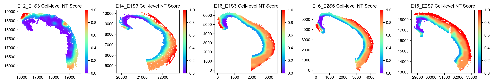

# Post-analysis

Below is an example of post-analysis on stereo-seq brain data.
The command for running on this dataset is:

```{sh}
ONTraC --meta-input data/stereo_seq_brain/original_data.csv --NN-dir output/stereo_seq_NN --GNN-dir output/stereo_seq_GNN --NT-dir output/stereo_seq_NT --device cuda -s 42 --lr 0.03 --hidden-feats 4 -k 6 --modularity-loss-weight 0.3 --regularization-loss-weight 0.1 --purity-loss-weight 300 --beta 0.03 2>&1 | tee log/stereo_seq.log
```

Download `stereo_seq_dataset_meta_input.csv` and precomputed results from [Zenodo](https://zenodo.org/records/XXXXXX)

## prepare

### Install required packages

```{sh}
pip install "ONTraC[analysis]==2.*"
# or
pip install seaborn
```

## One line command

You can get all the output figures with this command and check the results in `analysis_output` directory.

```{sh}
ONTraC_analysis -o analysis_output/stereo_seq -l log/stereo_seq.log --meta-input data/stereo_seq_brain/original_data.csv --NN-dir output/stereo_seq_NN --GNN-dir output/stereo_seq_GNN --NT-dir output/stereo_seq_NT -r
```

## Step-by-step analysis

If you want to adjust the figures, here is the example codes for step-by-step analysis using Python.
We recommand you using jupyter notebook or jupyter lab here.

### Load modules

```{python}
import matplotlib as mpl

mpl.rcParams['pdf.fonttype'] = 42
mpl.rcParams['ps.fonttype'] = 42
mpl.rcParams['font.family'] = 'Arial'
import matplotlib.pyplot as plt
import seaborn as sns

from ONTraC.analysis.data import AnaData
```

### Plotting preprare

```{python}
from optparse import Values

options = Values()
options.NN_dir = 'stereo_seq_NN'
options.GNN_dir = 'stereo_seq_GNN'
options.NT_dir = 'stereo_seq_NT'
options.log = 'stereo_seq.log'
options.reverse = True  # Set it to False if you don't want reverse NT score
options.embedding_adjust = False
options.output = None  # We save the output figure by our self here
ana_data = AnaData(options)
```

### Spatial cell type distribution

```{python}
from ONTraC.analysis.cell_type import plot_spatial_cell_type_distribution_dataset_from_anadata

fig, axes = plot_spatial_cell_type_distribution_dataset_from_anadata(ana_data = ana_data,
                                                                     hue_order = ['RGC', 'GlioB', 'NeuB', 'GluNeuB', 'GluNeu', 'GABA', 'Ery', 'Endo', 'Fibro', 'Basal'])

for ax in axes:
    # ax.set_aspect('equal', 'box')  # uncomment this line if you want set the x and y axis with same scaling
    # ax.set_xticks([])  # uncomment this line if you don't want to show x coordinates
    # ax.set_yticks([]) # uncomment this line if you don't want to show y coordinates
    pass

fig.tight_layout()
fig.savefig('Spatial_cell_type.png', dpi=150)
```


### Spatial cell type composition distribution

```{python}
from ONTraC.analysis.spatial import plot_cell_type_composition_dataset_from_anadata

fig, axes = plot_cell_type_composition_dataset_from_anadata(ana_data=ana_data)
fig.savefig('figures/cell_type_compostion.png', dpi=100)
```


### Niche cluster

#### Spatial niche cluster loadings distribution

```{python}
from ONTraC.analysis.niche_cluster import plot_niche_cluster_loadings_dataset_from_anadata

fig, axes = plot_niche_cluster_loadings_dataset_from_anadata(ana_data=ana_data)
fig.savefig('figures/Spatial_niche_clustering_loadings.png', dpi=100)
```


#### Spatial maximum niche cluster distribution

```{python}
from ONTraC.analysis.niche_cluster import plot_max_niche_cluster_dataset_from_anadata

fig, axes = plot_max_niche_cluster_dataset_from_anadata(ana_data=ana_data)
fig.savefig('figures/Spatial_max_niche_cluster.png', dpi=300)
```


#### Niche cluster connectivity

```{python}
from ONTraC.analysis.niche_cluster import plot_niche_cluster_connectivity_from_anadata

fig, axes = plot_niche_cluster_connectivity_from_anadata(ana_data=ana_data)
fig.savefig('figures/Niche_cluster_connectivity.png', dpi=300)
```


#### Niche cluster proportion

```{python}
from ONTraC.analysis.niche_cluster import plot_cluster_proportion_from_anadata

fig, ax = plot_cluster_proportion_from_anadata(ana_data=ana_data)
fig.savefig('figures/Niche_cluster_proportions.png', dpi=300)
```


### Cell type distribution in each niche cluster

#### number of cells of each cell type cells in each niche cluster

```{python}
from ONTraC.analysis.cell_type import plot_cell_type_loading_in_niche_clusters_from_anadata

g = plot_cell_type_loading_in_niche_clusters_from_anadata(ana_data=ana_data)
g.savefig('figures/cell_type_loading_in_niche_clusters.png', dpi=300)
```


#### cell type proportions in each cluster normalized by total loadings of each niche cluster

```{python}
from ONTraC.analysis.cell_type import plot_cell_type_dis_in_niche_clusters_from_anadata

fig, ax = plot_cell_type_dis_in_niche_clusters_from_anadata(ana_data=ana_data)
fig.savefig('figures/cell_type_dis_in_niche_clusters.png', dpi=300)
```


#### cell type proportions in each cluster normalized by the number of each cell type

```{python}
from ONTraC.analysis.cell_type import plot_cell_type_across_niche_cluster_from_anadata

fig, ax = plot_cell_type_across_niche_cluster_from_anadata(ana_data=ana_data)
fig.savefig('figures/cell_type_dis_across_niche_clusters.png', dpi=300)
```


### Spatial niche-level NT score distribution

NT score for each niche. Here, we use the anchor cells for each niche to represent niche-level NT score.

```{python}
from ONTraC.analysis.spatial import plot_niche_NT_score_dataset_from_anadata

fig, ax = plot_niche_NT_score_dataset_from_anadata(ana_data=ana_data)
fig.savefig('figures/niche_NT_score.png', dpi=200)
```


### Spatial cell-level NT score distribution

```{python}
from ONTraC.analysis.spatial import plot_cell_NT_score_dataset_from_anadata

fig, ax = plot_cell_NT_score_dataset_from_anadata(ana_data=ana_data)
fig.savefig('figures/cell_NT_score.png', dpi=200)
```



### Cell-level NT score distribution for each cell type

```{python}
from ONTraC.analysis.cell_type import plot_violin_cell_type_along_NT_score_from_anadata

fig, ax = plot_violin_cell_type_along_NT_score_from_anadata(ana_data=ana_data,
                                                            order=['RGC', 'GlioB', 'NeuB', 'GluNeuB', 'GluNeu', 'GABA', 'Ery', 'Endo', 'Fibro', 'Basal'],  # change based on your own dataset or remove this line
                                                           )
fig.savefig('figures/cell_type_along_NT_score_violin.png', dpi=300)
```


